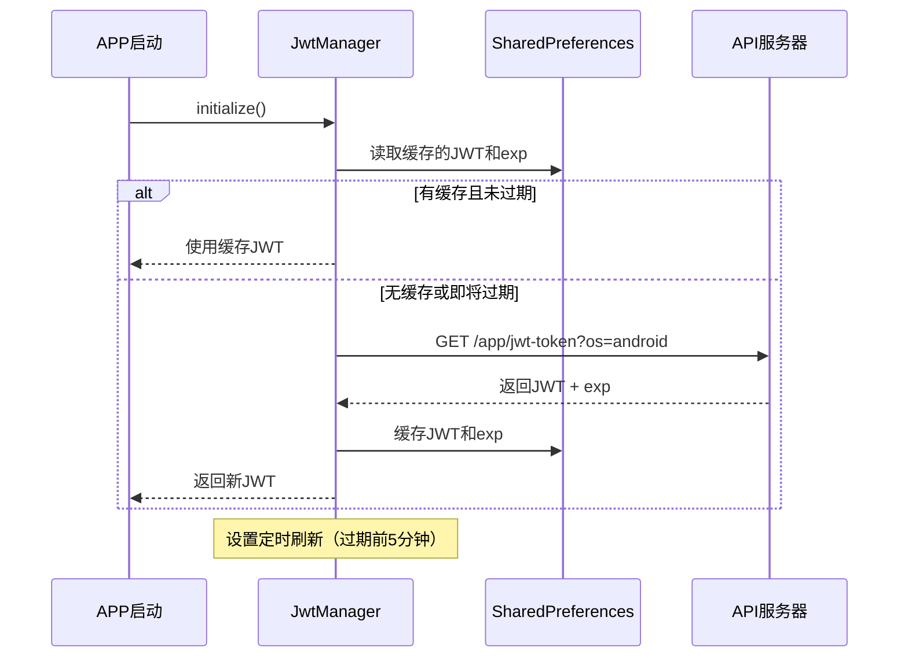

# 视频播放系统移植文档

> 本文档详细说明如何将原Android应用的视频播放逻辑移植到其他平台（Flutter/其他语言）
> 
> **已移除内容**: 广告系统、首页索引Banner、推广弹窗等营销相关代码

---

## 目录

1. [系统概述](#一系统概述)
2. [API地址配置](#二api地址配置)
3. [域名同步机制](#三域名同步机制)
4. [加密解密系统](#四加密解密系统)
5. [认证系统](#五认证系统)
6. [视频播放API详解](#六视频播放api详解)
   - [6.3 HLS播放与AES-128解密](#63-hls播放与aes-128解密新增)
7. [视频列表API详解](#七视频列表api详解)
8. [URL构建逻辑](#八url构建逻辑)
9. [CDN线路切换](#九cdn线路切换)
10. [离线播放与下载](#十离线播放与下载)
11. [封面图片处理](#十一封面图片处理)
12. [完整请求流程](#十二完整请求流程)
13. [数据模型](#十三数据模型)
14. [错误码对照表](#十四错误码对照表)
15. [移植代码示例](#十五移植代码示例)

---

## 一、系统概述

### 1.1 基本信息

| 项目 | 值 |
|------|------|
| 包名 | `com.zb.v1_8_14` / `com.zhubo.zhubo001` |
| 版本 | 1.2.8 |
| 目标SDK | Android 9 (API 28) |
| 最低SDK | Android 5.0 (API 21) |
| 网络框架 | Retrofit2 + OkHttp3 + RxJava2 |
| 视频播放器 | GSYVideoPlayer (基于ExoPlayer) |
| 下载库 | Aria |

### 1.2 技术栈

- **数据加密**: AES/ECB/PKCS5Padding
- **Token认证**: JWT (JSON Web Token)
- **域名轮换**: 50+备用域名自动故障转移
- **图片加载**: Glide (带自定义拦截器)

---

## 二、API地址配置

### 2.1 ⚠️ API地址状态（重要更新）

> **严重警告**: 经过实际测试验证，以下情况如下：

| API地址 | 状态 | 说明 |
|---------|------|------|
| `https://api.v8dw3c.shop`（源码中） | ❌ **已死亡** | 请求无响应（curl exit code 6），**不可使用** |
| `https://bkij1.aemtpwbdn3xf7b.xyz`（k.md中） | ✅ **正常工作** | 成功返回JWT和数据结构 |

**必须使用 k.md 中的API地址**：`https://bkij1.aemtpwbdn3xf7b.xyz`

### 2.2 固定CDN域名（来自抓包分析）

根据实际网络流量分析，以下CDN域名已验证可用：

| 用途 | 域名 | 说明 |
|------|------|------|
| API服务器 | `https://bkij1.aemtpwbdn3xf7b.xyz` | 主API地址 |
| 视频CDN（m3u8） | `https://qaes3u8.gmdalian.com` | HLS索引文件 |
| 视频CDN（ts/key） | `https://qaes3tx.gmdalian.com` | 媒体分片 + AES密钥 |
| 图片CDN | `https://qv1tx2.shoupingxz.com` | 封面图，有防盗链 |

**备用视频CDN**（主域名失效时切换）：
```
备用: https://qaes3u85.cloudworki.com
```

> **注意**: ts和key文件需要独立的鉴权请求头，详见第6.3节。

### 2.3 核心常量（来自 Api.java）

> **注意**: 以下地址为源码中的默认值，**已失效**。实际应使用2.1节的bkij1.aemtpwbdn3xf7b.xyz

```java
// 默认主API地址（旧版本，当前使用动态同步）
public static final String REQUEST_BASE_URL = "https://api.v8dw3c.shop/fast-cloud/";

// 调试API地址
public static final String DEBUG_BASE_URL = "http://api.babeweb.xyz/fast-cloud/";

// 成功响应码
public static final String SUCCESS = "0000";

// 错误响应码
public static final String ERROR = "1001";
```

### 2.3 固定请求凭证

| 名称 | 值 | 来源 |
|------|-----|------|
| accessToken | `FPCO3HQRBC3UNPSUH526WU0GF3KOI640` | 抓包获取，可能需登录刷新 |
| version | `1.2.8` 或 `9.9.9` | 源码返回版本号，抓包用9.9.9绕过检查 |

> **注意**: 源码中 accessToken 来自用户登录后的 UserBean，版本号为 `com.common.use.util.a.b()` 返回的包名版本号。k.md 中的值是抓包时实际使用的值，可能需要根据服务端要求调整。

### 2.4 BaseUrl管理

**存储位置**: SharedPreferences
```
Key: "base_url"     → 当前有效API地址
Key: "jwtToken"     → JWT认证令牌
Key: "LAST_URL_INDEX" → 域名轮询位置索引
Key: "business_domain_pool" → 备用域名池(逗号分隔)
```

**获取方式**:
```java
// Api.java 中定义
public static String getBaseUrl() {
    return SharedPreferencesUtils.getString("base_url", REQUEST_BASE_URL);
}
```

---

## 三、域名同步机制

### 3.1 备用域名池（共50个）

```xml
<!-- arrays.xml -->
<string-array name="hostList">
    <item>nsm42e3e07.xyz</item>
    <item>s76324vvh7.xyz</item>
    <item>w08acdqec0.xyz</item>
    <item>h14736uug8.xyz</item>
    <item>p60638wvg2.xyz</item>
    <!-- ... 共50个域名 -->
</string-array>
```

### 3.2 域名同步逻辑（DomainSyncWorker.java）

```java
// 应用启动时执行，每小时刷新
public class DomainSyncWorker extends Worker {
    private static final String TAG = "DomainSyncWorker";
    
    @Override
    public Result doWork() {
        if (!NetworkUtils.isConnected()) {
            return Result.failure();
        }
        
        // 1. 从最后成功的索引开始轮询
        int startIndex = prefs.getInt("LAST_URL_INDEX", 0);
        String[] domains = context.getResources().getStringArray(R.array.hostList);
        
        for (int i = 0; i < domains.length; i++) {
            String domain = domains[(startIndex + i) % domains.length];
            String url = "http://" + domain;
            
            try {
                // 2. 请求获取有效API地址
                Response response = client.newCall(
                    new Request.Builder().url(url).build()
                ).execute();
                
                BaseUrlBean bean = GsonUtils.fromJson(response.body().string(), BaseUrlBean.class);
                
                if (bean.getResult() != null && !bean.getResult().isEmpty()) {
                    // 3. 保存有效API地址
                    prefs.setString("base_url", bean.getResult());
                    
                    // 4. 保存备用域名池
                    if (bean.getPool() != null) {
                        prefs.setString("business_domain_pool", bean.getPool());
                    }
                    
                    // 5. 保存轮询位置
                    prefs.setInt("LAST_URL_INDEX", (startIndex + i) % domains.length);
                    
                    // 6. 获取JWT Token
                    getJwtToken(bean.getResult());
                    
                    return Result.success();
                }
            } catch (Exception e) {
                Log.e(TAG, "域名不可用: " + domain, e);
                continue;
            }
        }
        
        return Result.failure();
    }
    
    private void getJwtToken(String baseUrl) {
        String machineCode = DeviceUtils.getMachineCode();
        Request request = new Request.Builder()
            .url(baseUrl + "/app/jwt-token")
            .addHeader("machineCode", machineCode)
            .build();
        
        JwtTokenBean tokenBean = GsonUtils.fromJson(
            client.newCall(request).execute().body().string(), 
            JwtTokenBean.class
        );
        
        // 保存token
        prefs.setString("jwtToken", tokenBean.getResult());
    }
}
```

---

## 四、加密解密系统

### 4.1 加密配置（app/c0.java - OkHttp拦截器）

**10个轮换AES密钥**:
```java
public static final String[] KEYS = {
    "6eIZ4cxM5pqzUXcF",
    "84UZNK33cSVylz6Y",
    "jeSWRcTwHyAKwJDB",
    "i1hvJx9vuRt5zEBS",
    "1Yy1KOa75R7cnmkg",
    "4MVTQQAJlMpUIAiL",
    "T0RVp7KIPamrtQ33",
    "8HbPxhX6fjhhhwok",
    "ugvseZc5Kkj8ecmV",
    "G7i3OPcfNhBnAYpc"
};
```

**密钥选择逻辑**: `KEYS[(int)(System.currentTimeMillis() % 10)]`

**跳过加密的路径**:
- `/api.php`
- `/fast-cloud/verify/getcode`
- `/`

### 4.2 AES加密工具类（e/c0.java）

```java
public class AesUtil {
    private static final String TRANSFORMATION = "AES/ECB/PKCS5Padding";
    
    /**
     * AES加密
     * @param key 16位密钥
     * @param plainText 明文
     * @return Base64编码的密文
     */
    public static String encrypt(String key, String plainText) {
        try {
            Cipher cipher = Cipher.getInstance(TRANSFORMATION);
            SecretKeySpec keySpec = new SecretKeySpec(
                key.getBytes(StandardCharsets.UTF_8), "AES"
            );
            cipher.init(Cipher.ENCRYPT_MODE, keySpec);
            byte[] encrypted = cipher.doFinal(plainText.getBytes(StandardCharsets.UTF_8));
            return Base64.encodeToString(encrypted, Base64.NO_WRAP);
        } catch (Exception e) {
            e.printStackTrace();
            return null;
        }
    }
    
    /**
     * AES解密
     * @param key 16位密钥
     * @param base64CipherText Base64编码的密文
     * @return 明文
     */
    public static String decrypt(String key, String base64CipherText) {
        try {
            Cipher cipher = Cipher.getInstance(TRANSFORMATION);
            SecretKeySpec keySpec = new SecretKeySpec(
                key.getBytes(StandardCharsets.UTF_8), "AES"
            );
            cipher.init(Cipher.DECRYPT_MODE, keySpec);
            byte[] decoded = Base64.decode(base64CipherText, Base64.NO_WRAP);
            byte[] decrypted = cipher.doFinal(decoded);
            return new String(decrypted, StandardCharsets.UTF_8);
        } catch (Exception e) {
            e.printStackTrace();
            return null;
        }
    }
}
```

### 4.3 请求加密流程

```java
public Response intercept(Chain chain) throws IOException {
    Request request = chain.request();
    String url = request.url().toString();
    String method = request.method();
    
    // 跳过不需要加密的路径
    if (shouldSkip(url, method)) {
        return chain.proceed(request);
    }
    
    // 1. 获取当前时间的密钥
    long timestamp = System.currentTimeMillis();
    String key = KEYS[(int)(timestamp % 10)];
    
    // 2. 构建加密参数
    EncryptBean encryptBean = new EncryptBean();
    encryptBean.setTimestamp(timestamp);
    encryptBean.setMethod(getMethodCode(method)); // GET=0, POST=1, PUT=2
    encryptBean.setUri(extractPath(url));
    
    // 3. 如果有请求体，先序列化再加密
    if (request.body() != null) {
        String bodyStr = readBody(request.body());
        encryptBean.setBody(AesUtil.encrypt(key, bodyStr));
    } else if (request.url().encodedQuery() != null) {
        // GET请求，查询参数加密
        encryptBean.setParams(AesUtil.encrypt(key, request.url().encodedQuery()));
    }
    
    // 4. 序列化并再次加密
    String json = GsonUtils.toJson(encryptBean);
    String finalEncrypted = AesUtil.encrypt(key, json);
    
    // 5. 发送加密请求
    Request encryptedRequest = request.newBuilder()
        .url(url.replaceFirst("/[^/]+$", "/fast-endecode/main/request"))
        .post(RequestBody.create(finalEncrypted, MediaType.parse("application/json")))
        .build();
    
    return chain.proceed(encryptedRequest);
}
```

### 4.4 响应解密流程

```java
public Response intercept(Chain chain) throws IOException {
    Response response = chain.proceed(request);
    String responseBody = response.body().string();
    
    // 解析响应JSON
    JSONObject json = new JSONObject(responseBody);
    String data = json.optString("data");
    
    if (data == null || data.isEmpty()) {
        return response;
    }
    
    // 获取当前时间的密钥
    long timestamp = Long.parseLong(json.optString("timestamp", "0"));
    String key = KEYS[(int)(timestamp % 10)];
    
    // 解密data字段
    String decrypted = AesUtil.decrypt(key, data);
    
    // 替换响应体
    ResponseBody body = ResponseBody.create(
        decrypted, 
        MediaType.parse("application/json")
    );
    
    return response.newBuilder().body(body).build();
}
```

---

## 五、认证系统

### 5.1 JWT Token获取

**接口**: `POST {baseUrl}/app/jwt-token`

**请求头**:
```
machineCode: {设备唯一标识}
```

**响应**:
```json
{
    "code": "0000",
    "result": "eyJhbGciOiJIUzI1NiIsInR5cCI6IkpXVCJ9...",
    "message": "success"
}
```

**实现** (`e/i0.java`):
```java
public class JwtTokenUtil {
    public static JwtTokenBean getToken(String baseUrl, OkHttpClient client) throws IOException {
        String machineCode = DeviceUtils.getMachineCode();
        
        Request request = new Request.Builder()
            .url(baseUrl + "/app/jwt-token")
            .addHeader("machineCode", machineCode)
            .build();
        
        String response = client.newCall(request).execute().body().string();
        return GsonUtils.fromJson(response, JwtTokenBean.class);
    }
}
```

### 5.2 Token存储和使用

```java
// 存储
SharedPreferencesUtils.setString("jwtToken", tokenBean.getResult());

// 使用
String token = SharedPreferencesUtils.getString("jwtToken", "");
if (token.isEmpty()) {
    throw new AuthException("JWT Token为空");
}
```

### 5.3 Flutter JWT自动管理

> **重要**: Flutter版本使用自动JWT管理器，每次启动APP时自动获取并缓存JWT，过期前5分钟自动刷新。

#### 5.3.1 JWT获取流程



#### 5.3.2 核心代码实现

**JWT管理类** (`lib/managers/jwt_manager.dart`):

```dart
class JwtManager {
  static const String _apiKey = 'FPCO3HQRBC3UNPSUH526WU0GF3KOI640';
  static const String _apiVersion = '9.9.9';
  static const String _baseUrl = 'https://bkij1.aemtpwbdn3xf7b.xyz/fast-cloud';
  
  // 提前刷新时间：过期前5分钟
  static const Duration _refreshBefore = Duration(minutes: 5);
  
  // 获取JWT（自动处理过期刷新）
  static Future<String?> getJwt() async {
    if (_needsRefresh()) {
      return await _refreshIfNeeded();
    }
    return _prefs?.getString(_keyJwtToken);
  }
  
  // 强制刷新JWT
  static Future<String?> forceRefresh() async {
    return await _fetchNewJwt();
  }
  
  // 构建完整请求头
  static Future<Map<String, String>> getRequestHeaders() async {
    final jwt = await getJwt();
    return {
      'User-Agent': 'okhttp/3.12.0',
      'accessToken': _apiKey,
      'version': _apiVersion,
      if (jwt != null) 'jwtToken': jwt,
    };
  }
}
```

**在main.dart中初始化**:

```dart
void main() async {
  WidgetsFlutterBinding.ensureInitialized();
  
  // 初始化JWT管理器（自动获取并缓存）
  await JwtManager.initialize();
  
  runApp(const BiliGlassApp());
}
```

#### 5.3.3 请求头使用示例

**Dio拦截器方式**（推荐）:

```dart
final dio = Dio(BaseOptions(
  baseUrl: JwtManager.buildApiUrl(),
));

// 添加JWT拦截器
dio.interceptors.add(InterceptorsWrapper(
  onRequest: (options, handler) async {
    final headers = await JwtManager.getRequestHeaders();
    options.headers.addAll(headers);
    return handler.next(options);
  },
  onError: (DioError e, handler) async {
    // 401/403错误，强制刷新JWT后重试
    if (e.response?.statusCode == 401 || e.response?.statusCode == 403) {
      await JwtManager.forceRefresh();
      // 重试请求
      final retryOptions = e.requestOptions;
      retryOptions.headers.addAll(await JwtManager.getRequestHeaders());
      final response = await dio.request(
        retryOptions.path,
        options: Options(
          method: retryOptions.method,
          headers: retryOptions.headers,
        ),
        data: retryOptions.data,
      );
      return handler.resolve(response);
    }
    return handler.next(e);
  },
));
```

**普通HTTP请求方式**:

```dart
// 方式1: 直接调用
final headers = await JwtManager.getRequestHeaders();
final response = await http.get(
  Uri.parse(JwtManager.buildApiUrl(/cms/vod/detail/108934)),
  headers: headers,
);

// 方式2: 手动拼接
final jwt = await JwtManager.getJwt();
final url = 'https://bkij1.aemtpwbdn3xf7b.xyz/fast-cloud/cms/vod/detail/108934?os=android';
final response = await http.get(
  Uri.parse(url),
  headers: {
    'User-Agent': 'okhttp/3.12.0',
    'accessToken': 'FPCO3HQRBC3UNPSUH526WU0GF3KOI640',
    'version': '9.9.9',
    'jwtToken': jwt!,
  },
);
```

#### 5.3.4 视频播放请求头

播放视频时需要为CDN请求添加额外头：

```dart
// HLS播放请求头（m3u8/ts/key）
Future<Map<String, String>> getVideoHeaders() async {
  final base = await JwtManager.getRequestHeaders();
  return {
    ...base,
    'Referer': 'https://qaes3u8.gmdalian.com/',
  };
}

// 图片请求头（需要不同的Referer）
Future<Map<String, String>> getImageHeaders() async {
  return {
    'User-Agent': 'okhttp/3.12.0',
    'Referer': 'https://bkij1.aemtpwbdn3xf7b.xyz/',
  };
}
```

#### 5.3.5 JWT解析说明

JWT payload包含以下字段：

```json
{
  "adsCode": "DFH",     // 固定值
  "siteId": 1,         // 站点ID
  "exp": 1789317444    // 过期时间戳（秒）
}
```

- 有效期约 **24小时**
- 解码方式：`
  1. 取payload部分（第二段）
  2. Base64URL解码（替换 `-` → `+`, `_` → `/`）
  3. 补 padding（`=`）
  4. 解析JSON

---


---

## 五.5 完整请求头配置（关键）

> **重要**: 不同CDN域名需要不同的请求头配置，否则返回403。

### 5.5.1 API服务器请求头

用于获取视频详情、列表、JWT等API接口：

```
GET /fast-cloud/cms/vod/detail/108934?needCdnAuth=true&os=android
Host: bkij1.aemtpwbdn3xf7b.xyz
User-Agent: okhttp/3.12.0
accessToken: FPCO3HQRBC3UNPSUH526WU0GF3KOI640
version: 9.9.9
jwtToken: <获取到的JWT>
```

### 5.5.2 视频m3u8 CDN请求头

用于获取HLS索引文件（qaes3u8.gmdalian.com）：

```
GET /202609131518/.../index.m3u8
Host: qaes3u8.gmdalian.com
User-Agent: okhttp/3.12.0
Referer: https://qaes3u8.gmdalian.com/
accessToken: FPCO3HQRBC3UNPSUH526WU0GF3KOI640
version: 9.9.9
jwtToken: <JWT>
```

### 5.5.3 视频ts/key CDN请求头

用于获取媒体分片和AES密钥（qaes3tx.gmdalian.com）：

```
GET /202609131518/.../index0.ts
GET /202609131518/.../index.m3u8.key
Host: qaes3tx.gmdalian.com
User-Agent: okhttp/3.12.0
Referer: https://qaes3tx.gmdalian.com/
accessToken: FPCO3HQRBC3UNPSUH526WU0GF3KOI640
version: 9.9.9
jwtToken: <JWT>
```

> **注意**: ts和key文件的域名与m3u8不同！必须使用`qaes3tx.gmdalian.com`并设置对应的Referer。

### 5.5.4 图片CDN请求头

用于获取封面图片（qv1tx2.shoupingxz.com）：

```
GET /20221211/590892/img/WL0L0S0V450122360832.jpg
Host: qv1tx2.shoupingxz.com
User-Agent: okhttp/3.12.0
Referer: https://bkij1.aemtpwbdn3xf7b.xyz/
```

> **关键**: 图片CDN的Referer必须是API域名，不是图片域名本身！

### 5.5.5 统一请求头模板

```dart
class RequestHeaders {
  static const String API_HOST = 'https://bkij1.aemtpwbdn3xf7b.xyz';
  static const String VIDEO_M3U8_CDN = 'https://qaes3u8.gmdalian.com';
  static const String VIDEO_TS_CDN = 'https://qaes3tx.gmdalian.com';
  static const String IMAGE_CDN = 'https://qv1tx2.shoupingxz.com';
  
  static const String ACCESS_TOKEN = 'FPCO3HQRBC3UNPSUH526WU0GF3KOI640';
  static const String VERSION = '9.9.9';
  static const String USER_AGENT = 'okhttp/3.12.0';
  
  /// API服务器请求头
  static Map<String, String> apiHeaders(String jwtToken) => {
    'User-Agent': USER_AGENT,
    'accessToken': ACCESS_TOKEN,
    'version': VERSION,
    'jwtToken': jwtToken,
  };
  
  /// m3u8 CDN请求头
  static Map<String, String> m3u8Headers(String jwtToken) => {
    'User-Agent': USER_AGENT,
    'Referer': VIDEO_M3U8_CDN,
    'accessToken': ACCESS_TOKEN,
    'version': VERSION,
    'jwtToken': jwtToken,
  };
  
  /// ts/key CDN请求头
  static Map<String, String> tsHeaders(String jwtToken) => {
    'User-Agent': USER_AGENT,
    'Referer': VIDEO_TS_CDN,
    'accessToken': ACCESS_TOKEN,
    'version': VERSION,
    'jwtToken': jwtToken,
  };
  
  /// 图片CDN请求头
  static Map<String, String> imageHeaders() => {
    'User-Agent': USER_AGENT,
    'Referer': API_HOST,  // 注意：是API域名
  };
}
```

---

## 六、视频播放API详解

### 6.1 获取视频详情

**接口**: `MovieService.java:83`

```java
@GET("cms/vod/detail/{movieId}")
n<MovieDetailBean> getMovieDetail(
    @Path("movieId") long movieId, 
    @Query("needCdnAuth") boolean needAuth
);
```

**请求示例**:
```
GET /cms/vod/detail/12345?needCdnAuth=true
```

**响应结构** (`MovieDetailBean`):
```json
{
    "code": "0000",
    "message": "success",
    "result": {
        "vod": {
            "id": 12345,
            "title": "视频标题",
            "vodIntro": "视频简介",
            "vodPic": "封面图URL或路径",
            "vodPicInfo": "{\"horizontal_small\":\"...\",\"horizontal_large\":\"...\",\"vertical_small\":\"...\",\"vertical_large\":\"...\"}",
            "vodPlayUrl": "第1集$/path/to/video.ts#第2集$/path/to/video2.ts",
            "vodFullPlayUrl": [{"addr":"/path/video.ts","type":"720p","duration":180,"size":102400}],
            "mp4": "/path/to/mp4/video.mp4",
            "vodDuration": 180,
            "isVip": false,
            "gold": 0,
            "author": {
                "id": 100,
                "nickName": "作者名",
                "avatar": "头像URL"
            },
            "operation": {
                "isLike": false,
                "isCollection": false,
                "star": 0,
                "readChapterIndex": 0
            },
            "statistics": {
                "likeNumber": 1000,
                "readNumber": 5000,
                "starAvg": 4.8
            }
        }
    }
}
```

### 6.2 下载状态检查

**接口**: `FastCloudRepository.java`

```java
// 检查视频是否已下载
public boolean isMovieIsDownloadingOrComplete(String playUrl) {
    // 通过EventBus查询下载状态
    DownloadEvent event = EventBus.getDefault()
        .getstickyEvent(DownloadEvent.class);
    return event != null && event.isDownloadComplete(playUrl);
}
```

---

### 6.3 HLS播放与AES-128解密（新增）

> **重要发现**: 视频采用HLS协议播放，m3u8文件包含AES-128加密的ts分片。

#### 6.3.1 m3u8结构分析

通过实际抓包和测试，m3u8文件内容如下：

```m3u8
#EXTM3U
#EXT-X-VERSION:3
#EXT-X-TARGETDURATION:3
#EXT-X-MEDIA-SEQUENCE:0
#EXT-X-KEY:METHOD=AES-128,URI="https://qaes3tx.gmdalian.com/.../index.m3u8.key",IV=0x00000000000000000000000000000000
#EXTINF:3.000000,
https://qaes3tx.gmdalian.com/.../index0.ts
#EXTINF:3.000000,
https://qaes3tx.gmdalian.com/.../index1.ts
...
#EXT-X-ENDLIST
```

**关键发现**:
- m3u8中ts和key的URL都是**绝对URL**（包含完整域名）
- 使用AES-128加密，密钥从独立CDN获取
- 每个ts分片约3秒，视频总时长约540秒（180个分片）

#### 6.3.2 CDN域名分工

| CDN域名 | 用途 | 请求头要求 |
|---------|------|-----------|
| `qaes3u8.gmdalian.com` | m3u8索引文件 | 完整认证头 |
| `qaes3tx.gmdalian.com` | ts分片 + AES密钥 | 完整认证头 |
| `qv1tx2.shoupingxz.com` | 图片封面 | Referer头 |

#### 6.3.3 完整请求头配置

**获取m3u8（从api服务器）**:
```bash
curl "https://bkij1.aemtpwbdn3xf7b.xyz/fast-cloud/cms/vod/detail/108934?needCdnAuth=true&os=android" \
  -H "User-Agent: okhttp/3.12.0" \
  -H "accessToken: FPCO3HQRBC3UNPSUH526WU0GF3KOI640" \
  -H "version: 9.9.9" \
  -H "jwtToken: <获取到的JWT>"
```

**获取m3u8索引文件**:
```bash
curl "https://qaes3u8.gmdalian.com/202609131518/.../index.m3u8" \
  -H "User-Agent: okhttp/3.12.0" \
  -H "Referer: https://qaes3u8.gmdalian.com/" \
  -H "jwtToken: <JWT>" \
  -H "accessToken: FPCO3HQRBC3UNPSUH526WU0GF3KOI640" \
  -H "version: 9.9.9"
```

**获取ts分片**:
```bash
curl "https://qaes3tx.gmdalian.com/202609131518/.../index0.ts" \
  -H "User-Agent: okhttp/3.12.0" \
  -H "Referer: https://qaes3tx.gmdalian.com/" \
  -H "jwtToken: <JWT>" \
  -H "accessToken: FPCO3HQRBC3UNPSUH526WU0GF3KOI640" \
  -H "version: 9.9.9"
```

**获取AES密钥**:
```bash
curl "https://qaes3tx.gmdalian.com/202609131518/.../index.m3u8.key" \
  -H "User-Agent: okhttp/3.12.0" \
  -H "Referer: https://qaes3tx.gmdalian.com/" \
  -H "jwtToken: <JWT>" \
  -H "accessToken: FPCO3HQRBC3UNPSUH526WU0GF3KOI640" \
  -H "version: 9.9.9"
```

#### 6.3.4 Flutter HLS播放实现

```dart
import 'package:chewie/chewie.dart';
import 'package:video_player/video_player.dart';

class VideoPlayerService {
  static const String API_BASE = 'https://bkij1.aemtpwbdn3xf7b.xyz';
  static const String VIDEO_CDN_M3U8 = 'https://qaes3u8.gmdalian.com';
  static const String VIDEO_CDN_TS = 'https://qaes3tx.gmdalian.com';
  static const String IMAGE_CDN = 'https://qv1tx2.shoupingxz.com';
  
  static const String ACCESS_TOKEN = 'FPCO3HQRBC3UNPSUH526WU0GF3KOI640';
  static const String VERSION = '9.9.9';
  
  /// 获取JWT Token
  Future<String?> getJwtToken() async {
    final response = await http.get(
      Uri.parse('$API_BASE/fast-cloud/app/jwt-token?os=android'),
      headers: {
        'User-Agent': 'okhttp/3.12.0',
        'accessToken': ACCESS_TOKEN,
        'version': VERSION,
      },
    );
    
    if (response.statusCode == 200) {
      final data = json.decode(response.body);
      if (data['code'] == '0000') {
        return data['result'];
      }
    }
    return null;
  }
  
  /// 获取视频详情
  Future<Map<String, dynamic>?> getVideoDetail(String videoId, String jwtToken) async {
    final response = await http.get(
      Uri.parse('$API_BASE/fast-cloud/cms/vod/detail/$videoId?needCdnAuth=true&os=android'),
      headers: {
        'User-Agent': 'okhttp/3.12.0',
        'accessToken': ACCESS_TOKEN,
        'version': VERSION,
        'jwtToken': jwtToken,
      },
    );
    
    if (response.statusCode == 200) {
      return json.decode(response.body);
    }
    return null;
  }
  
  /// 解析播放URL（处理HLS相对路径）
  String resolvePlayUrl(String? playUrl, String jwtToken) {
    if (playUrl == null || playUrl.isEmpty) return '';
    
    // m3u8已经是绝对URL，直接使用
    if (playUrl.startsWith('http')) {
      return playUrl;
    }
    
    // 如果是相对路径，拼接m3u8 CDN域名
    final cleanPath = playUrl.startsWith('/') ? playUrl : '/$playUrl';
    return '$VIDEO_CDN_M3U8$cleanPath';
  }
  
  /// 获取带鉴权的m3u8内容
  Future<String?> fetchM3u8(String m3u8Url, String jwtToken) async {
    try {
      final response = await http.get(
        Uri.parse(m3u8Url),
        headers: {
          'User-Agent': 'okhttp/3.12.0',
          'Referer': VIDEO_CDN_M3U8,
          'jwtToken': jwtToken,
          'accessToken': ACCESS_TOKEN,
          'version': VERSION,
        },
      );
      
      if (response.statusCode == 200) {
        return response.body;
      }
    } catch (e) {
      print('Failed to fetch m3u8: $e');
    }
    return null;
  }
}
```

#### 6.3.5 HLS播放器配置

```dart
import 'package:chewie/chewie.dart';
import 'package:video_player/video_player.dart';

class ChewieHlsPlayer extends StatefulWidget {
  final String m3u8Url;
  final String jwtToken;
  
  const ChewieHlsPlayer({required this.m3u8Url, required this.jwtToken});
  
  @override
  _ChewieHlsPlayerState createState() => _ChewieHlsPlayerState();
}

class _ChewieHlsPlayerState extends State<ChewieHlsPlayer> {
  late VideoPlayerController _controller;
  ChewieController? _chewieController;
  bool _loading = true;
  
  @override
  void initState() {
    super.initState();
    _initializePlayer();
  }
  
  Future<void> _initializePlayer() async {
    // 构建带鉴权的播放URL
    final playUrl = widget.m3u8Url;
    
    // 使用http拦截器设置请求头
    _controller = VideoPlayerController.network(playUrl)
      ..setPluginOptions({
        'headers': {
          'User-Agent': 'okhttp/3.12.0',
          'Referer': 'https://qaes3u8.gmdalian.com/',
          'jwtToken': widget.jwtToken,
          'accessToken': VideoPlayerService.ACCESS_TOKEN,
          'version': VideoPlayerService.VERSION,
        },
      });
    
    try {
      await _controller.initialize();
      _chewieController = ChewieController(
        videoPlayerController: _controller,
        autoPlay: true,
        looping: false,
        aspectRatio: 16 / 9,
        errorBuilder: (context, errorMessage) {
          return Center(
            child: Text('播放失败: $errorMessage'),
          );
        },
      );
      setState(() => _loading = false);
    } catch (e) {
      print('Player error: $e');
      setState(() => _loading = false);
    }
  }
  
  @override
  void dispose() {
    _controller.dispose();
    _chewieController?.dispose();
    super.dispose();
  }
  
  @override
  Widget build(BuildContext context) {
    return Scaffold(
      appBar: AppBar(title: const Text('视频播放')),
      body: _loading
          ? const Center(child: CircularProgressIndicator())
          : _chewieController != null
              ? Chewie(controller: _chewieController!)
              : const Center(child: Text('播放器初始化失败')),
    );
  }
}
```

#### 6.3.6 注意事项

1. **m3u8中的绝对URL**: m3u8文件中的ts和key都是完整URL，播放器会直接请求这些URL
2. **请求头传递**: 需要确保播放器能够传递完整的认证头到所有子请求
3. **JWT过期**: Token有效期约30天，过期后需重新获取
4. **备用域名**: 如果`qaes3tx.gmdalian.com`不可用，可尝试`qaes3u85.cloudworki.com`

---

## 七、视频列表API详解

### 7.1 获取视频列表

**接口**: `MovieService.java:118`

```java
@GET("cms/query")
n<MovieListBean> getMovieList(
    @Query("groupId") String groupId, 
    @Query("page") int page
);
```

**请求示例**:
```
GET /cms/query?groupId=100&page=1
```

**响应结构** (`MovieListBean`):
```json
{
    "code": "0000",
    "data": {
        "list": [
            {
                "vodId": 12345,
                "vodName": "视频标题",
                "vodPic": "封面图URL",
                "vodPlayUrl": "/path/video.ts",
                "vodDuration": 180,
                "vodYear": "2024",
                "vodArea": "中国大陆",
                "vodClass": "剧情",
                "isVip": false,
                "gold": 0,
                "readNumber": 5000,
                "likeNumber": 100,
                "createTime": 1700000000
            }
        ],
        "total": 100,
        "page": 1,
        "pageSize": 20
    }
}
```

### 7.2 搜索视频

**接口**: `MovieService.java:138`

```java
@POST("cms/vod/search3")
n<MovieSearchBean> searchMovie(@Body RequestBody requestBody);
```

**请求参数**:
```json
{
    "page": 1,
    "pageSize": 20,
    "keyword": "搜索关键词",
    "groupId": 0,
    "groupIds": "",
    "tags": ["动作", "喜剧"],
    "tagsSort": [1, 2],
    "keywordType": 1,
    "sortType": 5
}
```

### 7.3 获取推荐视频

**接口**: `MovieService.java:105`

```java
@GET("cms/vod/recommend")
n<RecommendBean> getRecommend(@Nullable @Query("groupId") Long groupId);

@GET("cms/vod/recommend")
n<RecommendBean> getRecommendByPage(
    @Nullable @Query("groupId") Long groupId,
    @Query("page") int page, 
    @Query("pageSize") int pageSize
);
```

---

## 八、URL构建逻辑

### 8.1 URL拼接规则（h1.java）

```java
public class UrlUtil {
    /**
     * 拼接完整URL
     * @param path API路径或相对路径
     * @return 完整URL
     */
    public static String buildApiUrl(String path) {
        String baseUrl = SharedPreferencesUtils.getString("base_url", Api.DEFAULT_URL);
        if (!path.startsWith("http")) {
            return baseUrl + path;
        }
        return path;
    }
    
    /**
     * 提取文件扩展名
     * @param url 完整URL
     * @return 扩展名（不含点）
     */
    public static String getFileExtension(String url) {
        if (url == null || url.isEmpty()) {
            return "";
        }
        int lastDot = url.lastIndexOf('.');
        int queryStart = url.lastIndexOf('?');
        if (lastDot <= -1 || lastDot >= url.length() - 1) {
            return "";
        }
        int end = queryStart > -1 ? queryStart : url.length();
        return url.substring(lastDot + 1, end);
    }
}
```

### 8.2 ConfigBean中的CDN配置

**关键配置项** (`ConfigBean.ResultBean`):

| 字段 | 说明 | 示例值 |
|------|------|--------|
| `mp4domain` | MP4下载域名 | `https://cdn.example.com/` |
| `videoBaseUrl` | 视频基础URL | `https://vod.example.com/` |
| `newVideoBaseUrl` | 新版视频基础URL | `https://newvod.example.com/` |
| `newVideoUrl` | VIP视频URL | `https://vip.example.com/` |
| `picBaseUrl` | 图片基础URL | `https://qv1tx2.shoupingxz.com` |
| `playLinePoll` | CDN线路配置(JSON) | `[{"line":"https://qaes3u8.gmdalian.com","name":"国线1"}]` |
| `playLines` | 可用线路 | `cdn1,cdn2` |
| `maxVideoSize` | 最大视频大小(KB) | `1048576` |
| `imageSecret` | 图片密钥 | 存在但未在代码中使用 |

**videoBaseUrl获取逻辑**:
```java
public String getVideoBaseUrl() {
    // 优先使用手动切换的线路
    String savedLine = SharedPreferencesUtils.getString("save_line_key", "");
    if (!savedLine.isEmpty()) {
        return savedLine;
    }
    
    // VIP用户使用新URL
    boolean isVip = UserManager.getInstance().isVip();
    if (isVip && !newVideoUrl.isEmpty()) {
        return newVideoUrl;
    }
    
    // 默认使用新基础URL
    return !newVideoBaseUrl.isEmpty() ? newVideoBaseUrl : videoBaseUrl;
}

public String getPicBaseUrl() {
    String strB = g.a().b(ConfigBean.PIC_SAVE_LINE_CHANGE);
    return !TextUtils.isEmpty(strB) ? strB : this.picBaseUrl;
}
```

---

## 九、CDN线路切换

### 9.1 LinePoll模型

```java
public class LinePoll {
    private String line;   // CDN地址
    private String name;   // 显示名称（如"线路1"）
}
```

### 9.2 线路配置存储

```java
// 从ConfigBean获取JSON配置
String playLinePoll = configBean.getPlayLinePoll();
List<LinePoll> lines = GsonUtils.fromJson(playLinePoll, new TypeToken<List<LinePoll>>(){});

// 存储到SharedPreferences供后续使用
SharedPreferencesUtils.setString("playLinePoll", playLinePoll);

// 用户手动切换线路
SharedPreferencesUtils.setString("save_line_key", selectedLine.getLine());
```

### 9.3 播放时切换线路

```java
// PlayActivity.java
// 设置新的视频URL
this.Y.setNewVideoUrl(linePoll.getLine());
```

---

## 十、离线播放与下载

### 10.1 下载状态查询

```java
// 检查视频是否已下载
boolean isDownloaded = FastCloudRepository.getInstance()
    .isMovieIsDownloadingOrComplete(vodPlayUrl);

// 获取下载状态事件
DownloadEvent event = EventBus.getDefault()
    .getStickyEvent(DownloadEvent.class);
```

### 10.2 本地播放URL

```java
// PlayBean存储本地播放信息
public class PlayBean {
    private String playUrl;        // 在线播放URL
    private String downLoadUrl;    // 本地下载路径
    private long movieId;
    private String title;
    private String pic;
    private boolean isDownloadComplete;
    private String movieBeanStr;   // 视频数据(JSON)
}

// 判断使用本地还是在线播放
String playUrl = playBean.getPlayUrl();
if ("mp4".equalsIgnoreCase(UrlUtil.getFileExtension(playUrl))) {
    playUrl = playBean.getDownLoadUrl(); // 使用本地文件
}
```

### 10.3 本地存储路径

```java
// 缓存目录
public static File getCacheDir(Context context) {
    return context.getExternalCacheDir();
}

// 下载路径
public static String getDownloadPath(String fileName) {
    return getCacheDir(context).getPath() + "/" + fileName;
}
```

---

## 十一、封面图片处理

### 11.1 图片URL来源

视频封面图片有两个来源字段：

| 字段 | 类型 | 说明 |
|------|------|------|
| `vodPic` | String | 直接封面URL或路径 |
| `vodPicInfo` | String(JSON) | 多尺寸封面配置 |

**vodPicInfo JSON结构**:
```json
{
    "horizontal_small": "/path/small.jpg",    // 横版小图
    "horizontal_large": "/path/large.jpg",    // 横版大图
    "vertical_small": "/path/v_small.jpg",    // 竖版小图
    "vertical_large": "/path/v_large.jpg"     // 竖版大图
}
```

### 11.2 图片URL拼接逻辑

**关键代码** (`e/m1/c.java:226-227`):
```java
if (!isAbsoluteUrl(strD) && !strD.startsWith("http") 
    && resultBean != null && resultBean.getPicBaseUrl() != null) {
    // 拼接picBaseUrl
    String fullUrl = picBaseUrl.endsWith("/") || strD.startsWith("/")
        ? String.format("%s%s", picBaseUrl, strD)
        : String.format("%s/%s", picBaseUrl, strD);
}
```

**完整逻辑**:
```java
public String resolveImageUrl(String vodPic) {
    // 1. 如果是完整URL，直接返回
    if (vodPic == null || vodPic.startsWith("http")) {
        return vodPic;
    }
    
    // 2. 获取picBaseUrl配置
    ConfigBean.ResultBean config = ConfigManager.getInstance().getConfig();
    String picBaseUrl = config.getPicBaseUrl();
    
    if (picBaseUrl == null || picBaseUrl.isEmpty()) {
        return null;
    }
    
    // 3. 拼接完整URL
    return picBaseUrl.endsWith("/") ? picBaseUrl + vodPic 
                                    : picBaseUrl + "/" + vodPic;
}
```

### 11.3 为什么第三方程序无法显示图片

**根本原因分析**:

第三方程序无法直接显示图片，主要有以下三个原因：

#### 原因1: 相对路径未拼接picBaseUrl

API返回的 `vodPic` 字段通常是相对路径：
```json
{
    "vodPic": "/20221211/590892/img/WL0L0S0V450122360832.jpg"
}
```
必须拼接 `picBaseUrl` 才能访问：
```
完整URL = picBaseUrl + vodPic
        = https://qv1tx2.shoupingxz.com/20221211/590892/img/WL0L0S0V450122360832.jpg
```

#### 原因2: 图片CDN防盗链

图片CDN `qv1tx2.shoupingxz.com` 启用了防盗链，直接请求会返回 **403**。
需要设置正确的请求头：
```
User-Agent: okhttp/3.12.0
Referer: https://bkij1.aemtpwbdn3xf7b.xyz/
```

#### 原因3: 缺少必要的认证头

部分图片请求可能需要 JWT Token 或其他认证信息。

**图片URL拼接规则**（来自 `e/m1/c.java:226-227`）:
```java
// 判断是否为绝对路径
if (!isAbsoluteUrl(vodPic) && !vodPic.startsWith("http") 
    && resultBean != null && resultBean.getPicBaseUrl() != null) {
    // 拼接picBaseUrl
    String fullUrl = picBaseUrl.endsWith("/") || vodPic.startsWith("/")
        ? String.format("%s%s", picBaseUrl, vodPic)
        : String.format("%s/%s", picBaseUrl, vodPic);
}
```

**Flutter/Dart实现**:
```dart
String buildImageUrl(String vodPic, String picBaseUrl) {
  // 已经是完整URL
  if (vodPic.startsWith('http')) {
    return vodPic;
  }
  // 拼接picBaseUrl
  bool needsSlash = !picBaseUrl.endsWith('/') && !vodPic.startsWith('/');
  return '$picBaseUrl${needsSlash ? '/' : ''}$vodPic';
}
```

### 11.4 图片防盗链处理

**请求头必须包含**:
```
User-Agent: okhttp/3.12.0
Referer: https://bkij1.aemtpwbdn3xf7b.xyz/
```

**Flutter实现（推荐使用 CachedNetworkImage）**:
```dart
CachedNetworkImage(
  imageUrl: coverUrl,
  headers: {
    "User-Agent": "okhttp/3.12.0",
    "Referer": "https://bkij1.aemtpwbdn3xf7b.xyz/",
  },
  placeholder: (context, url) => CircularProgressIndicator(),
  errorWidget: (context, url, error) => Icon(Icons.error),
)
```

**备选Referer**（如果第一个不行，依次尝试）:
```
1. https://bkij1.aemtpwbdn3xf7b.xyz/
2. https://qaes3u8.gmdalian.com/
3. https://qv1tx2.shoupingxz.com/
```

### 11.5 Glide自定义拦截器（源码参考）

源码中使用了自定义拦截器处理特殊图片URL：
```java
// e/m1/c.java - Glide图片加载
private static class InterceptorImpl implements Interceptor {
    @Override
    public Response intercept(Chain chain) throws IOException {
        Response responseProceed = chain.proceed(chain.request());
        String url = chain.request().url().toString();
        
        // 对 ?e=1 或 qv1 的图片URL转换为PNG格式
        if (!url.contains("?e=1") && !url.contains("qv1")) {
            return responseProceed;
        }
        
        ResponseBody newBody = ResponseBody.create(
            MediaType.parse("image/png"),
            convertToPng(responseProceed.body().bytes())
        );
        return responseProceed.newBuilder().body(newBody).build();
    }
}
```

> **说明**: Flutter端无需此逻辑，直接使用 standard image loader 即可。

### 11.6 图片尺寸配置

视频封面支持多尺寸配置（`vodPicInfo` 字段）:
```json
{
    "horizontal_small": "/path/small.jpg",
    "horizontal_large": "/path/large.jpg",
    "vertical_small": "/path/v_small.jpg",
    "vertical_large": "/path/v_large.jpg"
}
```

解析方法：
```dart
VodPicInfoBean parsePicInfo(String vodPicInfoJson) {
  try {
    final map = jsonDecode(vodPicInfoJson);
    return VodPicInfoBean(
      horizontalSmall: map['horizontal_small'] as String?,
      horizontalLarge: map['horizontal_large'] as String?,
      verticalSmall: map['vertical_small'] as String?,
      verticalLarge: map['vertical_large'] as String?,
    );
  } catch (e) {
    return null;
  }
}
```

### 11.4 图片加载配置（Glide）

**图片加载器** (`e/o0.java`):
```java
public class ImageUtil {
    private static final int PLACEHOLDER = R.drawable.placeholder_big_h;
    private static final int ERROR_IMAGE = R.mipmap.default_avatar;
    
    public static void loadImage(Context context, String url, ImageView imageView) {
        GlideApp.with(context)
            .load(url)
            .placeholder(PLACEHOLDER)
            .error(ERROR_IMAGE)
            .centerCrop()
            .into(imageView);
    }
    
    public static void loadImageWithRound(Context context, String url, ImageView imageView) {
        GlideApp.with(context)
            .load(url)
            .placeholder(PLACEHOLDER)
            .error(ERROR_IMAGE)
            .circleCrop()
            .into(imageView);
    }
}
```

---

## 十二、完整请求流程

### 12.1 应用启动流程

```
应用启动
    ↓
DomainSyncWorker (后台任务)
    ├── 遍历50个备用域名
    ├── 请求 http://{domain}/fast-cloud/
    ├── 获取 BaseUrlBean
    │   ├── result: 有效API地址
    │   └── pool: 备用域名池
    └── 存储到 SharedPreferences
    ↓
获取 JWT Token
    ├── 请求 /app/jwt-token
    ├── 携带 machineCode 头
    └── 存储 token 到 SharedPreferences
    ↓
获取应用配置
    ├── 请求 /config/query?groupKey=APP&key=...
    └── 存储 CDN配置、域名等
```

### 12.2 视频播放完整流程

```
用户点击视频
    ↓
检查本地缓存/下载状态
    ├── 已下载 → 使用本地路径播放
    └── 未下载 → 继续
    ↓
调用 getMovieDetail(movieId, needCdnAuth=true)
    ↓
[加密请求]
    ├── 获取当前密钥 (时间戳 % 10)
    ├── 序列化请求参数
    ├── AES加密
    └── POST 到 /fast-endecode/main/request
    ↓
[解密响应]
    ├── 接收响应
    ├── 提取 data 字段
    ├── AES解密
    └── 反序列化为 MovieDetailBean
    ↓
检查响应码
    ├── 0000: 成功 → 继续
    ├── 1033/1034: Token无效 → 重新获取Token
    ├── 1032/1019: 登录失效 → 跳转登录
    ├── 1002/1012/1003: 免费次数限制
    ├── 1008: VIP限制
    └── 1038/1035: 金币不足
    ↓
构建播放URL
    ├── 获取 vodPlayUrl
    ├── 检查 mp4 字段
    ├── 拼接 videoBaseUrl 或 mp4domain
    └── 得到完整播放地址
    ↓
构建封面URL
    ├── 获取 vodPic
    ├── 检查是否为相对路径
    ├── 拼接 picBaseUrl
    └── 得到完整封面地址
    ↓
初始化播放器
    ├── GSYVideoPlayer
    ├── 设置多分辨率URL
    ├── 配置CDN线路
    └── 开始播放
    ↓
播放统计上报
    └── POST /user/behavior/collection/watch_video
```

---

## 十三、数据模型

### 13.1 MovieBean（视频核心模型）

```java
public class MovieBean implements Serializable, Parcelable {
    // 基本信息
    long id;                    // 视频ID
    String title;               // 标题
    String vodIntro;            // 简介
    String vodPic;              // 封面图URL或路径
    String vodPicInfo;          // 封面图多尺寸配置(JSON)
    String vodPicSlide;         // 轮播图
    String vodPicThumb;         // 缩略图
    
    // 播放信息
    String vodPlayUrl;          // 播放地址（多集用#分隔）
    List<VodFullPlayUrl> vodFullPlayUrl;  // 多分辨率URL列表
    String mp4;                 // MP4下载路径
    long vodDuration;           // 时长(毫秒)
    
    // 分类信息
    String vodClass;            // 类型
    String vodArea;             // 地区
    String vodLang;             // 语言
    String vodYear;             // 年份
    String vodVersion;          // 版本
    
    // 用户信息
    AuthorBean authors;         // 作者信息
    int isVip;                  // 是否VIP(0/1)
    int gold;                   // 所需金币
    boolean isAd;               // 是否广告
    
    // 统计数据
    int readNumber;             // 播放量
    int likeNumber;             // 点赞数
    int comments;               // 评论数
    long createTime;            // 创建时间
    int playNum;                // 播放次数
    
    // 其他
    String cover;               // 封面（可能是另一字段）
    String sn;                  // 序列号
    long cmsId;                 // CMS ID
    int priority;               // 优先级
    int status;                 // 状态
    int auditStatus;            // 审核状态
    
    // 多分辨率URL内部类
    public static class VodFullPlayUrl implements Parcelable {
        String addr;            // 视频地址
        int duration;           // 时长(毫秒)
        long size;              // 文件大小(KB)
        String type;            // 分辨率描述（如 "720p", "1080p"）
    }
    
    // 封面图尺寸配置内部类
    public static class VodPicInfoBean {
        String horizontal_small;   // 横版小图
        String horizontal_large;   // 横版大图
        String vertical_small;     // 竖版小图
        String vertical_large;     // 竖版大图
    }
}
```

### 13.2 MovieDetailBean（视频详情响应）

```java
public class MovieDetailBean {
    String code;              // 响应码
    String message;           // 消息
    MovieDetailResultBean result;  // 结果数据
}

public class MovieDetailResultBean {
    MovieBean vod;              // 视频信息
    AuthorBean author;          // 作者信息
    OperationBean operation;    // 操作状态
    StatisticsBean statistics;  // 统计数据
}

public class OperationBean {
    int isLike;           // 是否点赞
    int isCollection;     // 是否收藏
    int star;             // 评分
    int readChapterIndex; // 上次观看位置
}

public class StatisticsBean {
    int likeNumber;   // 点赞数
    int readNumber;   // 播放数
    double starAvg;   // 平均评分
}
```

### 13.3 ConfigBean（应用配置）

```java
public class ConfigBean {
    String code;
    String message;
    ResultBean result;
    
    public static class ResultBean {
        // CDN配置
        String picBaseUrl;          // 图片基础URL
        String mp4domain;           // MP4下载域名
        String videoBaseUrl;        // 视频基础URL
        String newVideoBaseUrl;     // 新版视频基础URL
        String newVideoUrl;         // VIP视频URL
        String playLinePoll;        // CDN线路配置(JSON)
        String playLines;           // 可用线路
        
        // 功能配置
        int play_ads_show_times;    // 广告显示次数限制
        long maxVideoSize;          // 最大视频大小(KB)
        int colLimit;               // 收藏限制
        int colLimit_vip;           // VIP收藏限制
        
        // 用户配置
        int maxFreeUserPlay;        // 免费用户最大播放次数
        int todayFreeUserPlay;      // 今日免费播放次数
        
        // 其他配置
        String hotSearch;           // 热搜词
        String shareUrl;            // 分享URL
        String officialUrl;         // 官方URL
        // ... 更多配置项
    }
}
```

### 13.4 BaseUrlBean（域名同步响应）

```java
public class BaseUrlBean {
    String status;      // 状态码
    String result;      // 有效API地址
    String pool;        // 备用域名池(逗号分隔)
}
```

### 13.5 JwtTokenBean（JWT响应）

```java
public class JwtTokenBean {
    String code;
    Object data;
    String message;
    String result;      // JWT Token字符串
    String total;
}
```

---

## 十四、错误码对照表

### 14.1 API错误码

| 错误码 | 含义 | 处理方式 |
|--------|------|----------|
| `0000` | 成功 | 正常处理 |
| `1001` | 通用错误 | 提示网络错误 |
| `1002` | 非VIP限制 | 引导开通VIP |
| `1003` | 普通用户限制 | 提示登录 |
| `1005` | 参数为空 | 检查请求参数 |
| `1006` | 手机号重复 | 提示已注册 |
| `1007` | 密码错误 | 提示重试 |
| `1008` | 需付费 | 引导付费 |
| `1012` | 游客限制 | 提示登录 |
| `1019` | Token无效 | 清除登录状态 |
| `1031` | 参数错误 | 检查请求参数 |
| `1032` | Token为空 | 清除登录状态 |
| `1033` | JWT Token为空 | 重新获取Token |
| `1034` | JWT Token无效 | 重新获取Token |
| `1035` | 金币不足(VIP) | 提示充值 |
| `1038` | 金币不足 | 提示充值 |
| `99999999999` | 需VIP | 引导开通VIP |

### 14.2 特殊处理码

```
1038/1035 → 弹出支付对话框（金币支付）
1002/1012/1003 → 显示免费次数限制提示
1008 → 显示VIP购买提示
1033/1034 → 自动重新获取JWT Token
1032/1019 → 清除用户登录状态，跳转登录页
```

---

## 十五、移植代码示例

### 15.1 Flutter 实现示例

#### 1. 域名同步

```dart
class DomainSyncManager {
  static const List<String> backupDomains = [
    'nsm42e3e07.xyz',
    's76324vvh7.xyz',
    'w08acdqec0.xyz',
    'h14736uug8.xyz',
    'p60638wvg2.xyz',
    // ... 更多域名
  ];
  
  static const String defaultBaseUrl = 'https://api.v8dw3c.shop/fast-cloud/';
  
  /// 同步有效域名
  static Future<String> syncDomain() async {
    final prefs = await SharedPreferences.getInstance();
    int lastIndex = prefs.getInt('LAST_URL_INDEX') ?? 0;
    
    for (int i = 0; i < backupDomains.length; i++) {
      int index = (lastIndex + i) % backupDomains.length;
      String domain = backupDomains[index];
      
      try {
        final url = 'http://$domain/fast-cloud/';
        final response = await http.get(Uri.parse(url));
        
        if (response.statusCode == 200) {
          final data = jsonDecode(response.body);
          if (data['status'] == '200' && data['result'] != null) {
            await prefs.setString('base_url', data['result']);
            await prefs.setInt('LAST_URL_INDEX', index);
            
            if (data['pool'] != null) {
              await prefs.setString('business_domain_pool', data['pool']);
            }
            return data['result'];
          }
        }
      } catch (e) {
        debugPrint('域名 $domain 不可用: $e');
        continue;
      }
    }
    
    return defaultBaseUrl;
  }
}
```

#### 2. AES加密工具

```dart
import 'dart:convert';
import 'package:flutter/crypto/crypto.dart';
import 'package:encrypt/encrypt.dart' as encrypt;

class AesEncryptUtil {
  // 10个轮换密钥
  static const List<String> KEYS = [
    '6eIZ4cxM5pqzUXcF',
    '84UZNK33cSVylz6Y',
    'jeSWRcTwHyAKwJDB',
    'i1hvJx9vuRt5zEBS',
    '1Yy1KOa75R7cnmkg',
    '4MVTQQAJlMpUIAiL',
    'T0RVp7KIPamrtQ33',
    '8HbPxhX6fjhhhwok',
    'ugvseZc5Kkj8ecmV',
    'G7i3OPcfNhBnAYpc'
  ];
  
  /// 获取当前密钥
  static String getCurrentKey() {
    int index = DateTime.now().millisecondsSinceEpoch ~/ 1000 % 10;
    return KEYS[index];
  }
  
  /// AES加密
  static String encrypt(String plainText) {
    String key = getCurrentKey();
    final aes = encrypt.AES(encrypt.AESKey.fromHexString(key));
    final encrypted = aes.encrypt(plainText);
    return base64Encode(encrypted.bytes);
  }
  
  /// AES解密
  static String decrypt(String cipherText) {
    String key = getCurrentKey();
    final aes = encrypt.AES(encrypt.AESKey.fromHexString(key));
    final decrypted = aes.decrypt64(cipherText);
    return decrypted;
  }
}
```

#### 3. API客户端

```dart
class ApiClient {
  static const List<String> skipPaths = [
    '/api.php',
    '/fast-cloud/verify/getcode',
    '/'
  ];
  
  final http.Client _client = http.Client();
  late String _baseUrl;
  late String _jwtToken;
  
  ApiClient(this._baseUrl, this._jwtToken);
  
  /// 发送GET请求
  Future<T> get<T>(String path, {Map<String, String>? params}) async {
    if (_shouldEncrypt(path)) {
      return _encryptedRequest<T>('GET', path, params: params);
    }
    return _directRequest<T>('GET', path, params: params);
  }
  
  /// 发送POST请求
  Future<T> post<T>(String path, {dynamic data}) async {
    if (_shouldEncrypt(path)) {
      return _encryptedRequest<T>('POST', path, data: data);
    }
    return _directRequest<T>('POST', path, data: data);
  }
  
  bool _shouldEncrypt(String path) {
    return !skipPaths.any((p) => path.contains(p));
  }
  
  Future<T> _encryptedRequest<T>(String method, String path, {Map<String, String>? params, dynamic data}) async {
    String key = AesEncryptUtil.getCurrentKey();
    long timestamp = DateTime.now().millisecondsSinceEpoch;
    
    // 构建加密参数
    Map<String, dynamic> encryptData = {
      'timestamp': timestamp,
      'method': _getMethodCode(method),
      'uri': path,
    };
    
    if (data != null) {
      encryptData['body'] = AesEncryptUtil.encrypt(jsonEncode(data));
    } else if (params != null) {
      encryptData['params'] = AesEncryptUtil.encrypt(Uri.encodeQueryComponent(Map.from(params).entries.map((e) => '${e.key}=${e.value}').join('&')));
    }
    
    String encrypted = AesEncryptUtil.encrypt(jsonEncode(encryptData));
    
    final url = Uri.parse('$_baseUrl/fast-endecode/main/request');
    final response = await _client.post(
      url,
      headers: {'Content-Type': 'application/json'},
      body: encrypted,
    );
    
    // 解密响应
    if (response.statusCode == 200) {
      final jsonData = jsonDecode(response.body);
      String data = jsonData['data'];
      if (data != null) {
        String decrypted = AesEncryptUtil.decrypt(data);
        return jsonDecode(decrypted) as T;
      }
    }
    
    throw Exception('请求失败: ${response.statusCode}');
  }
  
  int _getMethodCode(String method) {
    switch (method.toUpperCase()) {
      case 'GET': return 0;
      case 'POST': return 1;
      case 'PUT': return 2;
      default: return -1;
    }
  }
  
  Future<T> _directRequest<T>(String method, String path, {Map<String, String>? params, dynamic data}) async {
    final url = Uri.parse('$_baseUrl$path');
    
    final response = method.toUpperCase() == 'GET'
        ? await _client.get(url, queryParameters: params)
        : await _client.post(url, queryParameters: params, body: data);
    
    if (response.statusCode == 200) {
      return jsonDecode(response.body) as T;
    }
    
    throw Exception('请求失败: ${response.statusCode}');
  }
  
  void dispose() {
    _client.close();
  }
}
```

#### 4. 视频播放器

```dart
import 'package:video_player/video_player.dart';

class VideoPlayerControllerWrapper {
  VideoPlayerController? _controller;
  String? _currentQuality;
  
  /// 初始化播放器
  Future<void> initialize(String url, {List<VideoQuality>? qualities}) async {
    // 如果有多个质量，选择默认或最高质量
    String playUrl = qualities != null && qualities.isNotEmpty 
        ? qualities.first.url 
        : url;
    
    _controller = VideoPlayerController.networkUrl(Uri.parse(playUrl));
    await _controller!.initialize();
  }
  
  /// 切换质量
  Future<void> switchQuality(String url) async {
    await _controller?.dispose();
    _controller = VideoPlayerController.networkUrl(Uri.parse(url));
    await _controller!.initialize();
  }
  
  void play() => _controller?.play();
  void pause() => _controller?.pause();
  void seekTo(Duration position) => _controller?.seekTo(position);
  
  VideoPlayerController? get controller => _controller;
}

class VideoQuality {
  final String url;
  final String label;
  final int height;
  
  VideoQuality({required this.url, required this.label, required this.height});
}
```

### 15.2 Python 实现示例

#### 1. 请求客户端

```python
import requests
import base64
import json
from datetime import datetime
from cryptography.hazmat.primitives.ciphers import Cipher, algorithms, modes
from cryptography.hazmat.primitives import padding
from cryptography.hazmat.backends import default_backend

class AesEncryptor:
    KEYS = [
        "6eIZ4cxM5pqzUXcF",
        "84UZNK33cSVylz6Y",
        "jeSWRcTwHyAKwJDB",
        "i1hvJx9vuRt5zEBS",
        "1Yy1KOa75R7cnmkg",
        "4MVTQQAJlMpUIAiL",
        "T0RVp7KIPamrtQ33",
        "8HbPxhX6fjhhhwok",
        "ugvseZc5Kkj8ecmV",
        "G7i3OPcfNhBnAYpc"
    ]
    
    @classmethod
    def get_current_key(cls):
        index = int(datetime.now().timestamp() // 1) % 10
        return cls.KEYS[index]
    
    @classmethod
    def encrypt(cls, plaintext: str) -> str:
        key = cls.get_current_key()
        padder = padding.PKCS7(128).padder()
        padded_data = padder.update(plaintext.encode()) + padder.finalize()
        
        cipher = Cipher(algorithms.AES(key.encode()), modes.ECB(), backend=default_backend())
        encryptor = cipher.encryptor()
        ciphertext = encryptor.update(padded_data) + encryptor.finalize()
        
        return base64.b64encode(ciphertext).decode()
    
    @classmethod
    def decrypt(cls, ciphertext: str) -> str:
        key = cls.get_current_key()
        decoded = base64.b64decode(ciphertext)
        
        cipher = Cipher(algorithms.AES(key.encode()), modes.ECB(), backend=default_backend())
        decryptor = cipher.decryptor()
        padded_plaintext = decryptor.update(decoded) + decryptor.finalize()
        
        unpadder = padding.PKCS7(128).unpadder()
        plaintext = unpadder.update(padded_plaintext) + unpadder.finalize()
        
        return plaintext.decode()


class VideoApiClient:
    SKIP_PATHS = ['/api.php', '/fast-cloud/verify/getcode', '/']
    
    def __init__(self, base_url: str, jwt_token: str):
        self.base_url = base_url.rstrip('/')
        self.jwt_token = jwt_token
        self.session = requests.Session()
        self.session.headers.update({
            'Content-Type': 'application/json',
            'Authorization': f'Bearer {jwt_token}'
        })
    
    def _should_encrypt(self, path: str) -> bool:
        return not any(path.startswith(p.lstrip('/')) for p in self.SKIP_PATHS)
    
    def get(self, path: str, params: dict = None):
        url = f"{self.base_url}{path}"
        
        if self._should_encrypt(path):
            return self._encrypted_request('GET', url, params=params)
        
        response = self.session.get(url, params=params)
        return response.json()
    
    def post(self, path: str, data: dict = None):
        url = f"{self.base_url}{path}"
        
        if self._should_encrypt(path):
            return self._encrypted_request('POST', url, data=data)
        
        response = self.session.post(url, json=data)
        return response.json()
    
    def _encrypted_request(self, method: str, url: str, params: dict = None, data: dict = None):
        key = AesEncryptor.get_current_key()
        timestamp = int(datetime.now().timestamp() * 1000)
        
        encrypt_data = {
            'timestamp': timestamp,
            'method': {'GET': 0, 'POST': 1, 'PUT': 2}.get(method, -1),
            'uri': url
        }
        
        if data:
            encrypt_data['body'] = AesEncryptor.encrypt(json.dumps(data))
        elif params:
            param_str = '&'.join(f"{k}={v}" for k, v in params.items())
            encrypt_data['params'] = AesEncryptor.encrypt(param_str)
        
        encrypted = AesEncryptor.encrypt(json.dumps(encrypt_data))
        
        response = self.session.post(
            f"{self.base_url}/fast-endecode/main/request",
            json=json.loads(encrypted)
        )
        
        # 解密响应
        if response.status_code == 200:
            response_data = response.json()
            if 'data' in response_data:
                decrypted = AesEncryptor.decrypt(response_data['data'])
                return json.loads(decrypted)
        
        return response.json()
    
    def get_movie_detail(self, movie_id: int):
        """获取视频详情"""
        return self.get(f"/cms/vod/detail/{movie_id}", params={"needCdnAuth": True})
    
    def get_movie_list(self, group_id: str, page: int = 1):
        """获取视频列表"""
        return self.get("/cms/query", params={"groupId": group_id, "page": page})
    
    def search_movies(self, keyword: str, page: int = 1):
        """搜索视频"""
        return self.post("/cms/vod/search3", data={
            "page": page,
            "pageSize": 20,
            "keyword": keyword
        })
```

#### 2. 域名同步

```python
import requests
import json
from typing import Optional, List

class DomainSyncManager:
    BACKUP_DOMAINS = [
        'nsm42e3e07.xyz',
        's76324vvh7.xyz',
        'w08acdqec0.xyz',
        'h14736uug8.xyz',
        'p60638wvg2.xyz',
        # ... 更多域名
    ]
    
    DEFAULT_BASE_URL = 'https://api.v8dw3c.shop/fast-cloud/'
    
    def __init__(self, storage: dict):
        self.storage = storage  # 模拟SharedPreferences
        self.session = requests.Session()
        self.session.headers.update({
            'User-Agent': 'Mozilla/5.0 (Linux; Android 12) AppleWebKit/537.36'
        })
    
    def sync_domain(self) -> str:
        """同步有效域名"""
        last_index = self.storage.get('LAST_URL_INDEX', 0)
        
        for i in range(len(self.BACKUP_DOMAINS)):
            index = (last_index + i) % len(self.BACKUP_DOMAINS)
            domain = self.BACKUP_DOMAINS[index]
            url = f"http://{domain}/fast-cloud/"
            
            try:
                response = self.session.get(url, timeout=5)
                data = response.json()
                
                if data.get('status') == '200' and data.get('result'):
                    self.storage['base_url'] = data['result']
                    self.storage['LAST_URL_INDEX'] = index
                    
                    if data.get('pool'):
                        self.storage['business_domain_pool'] = data['pool']
                    
                    return data['result']
                    
            except Exception as e:
                print(f"域名 {domain} 不可用: {e}")
                continue
        
        return self.DEFAULT_BASE_URL
    
    def get_jwt_token(self, base_url: str, machine_code: str) -> str:
        """获取JWT Token"""
        url = f"{base_url}/app/jwt-token"
        response = self.session.get(
            url,
            headers={'machineCode': machine_code}
        )
        data = response.json()
        
        if data.get('code') == '0000':
            self.storage['jwtToken'] = data['result']
            return data['result']
        
        raise Exception(f"获取Token失败: {data.get('message')}")
```

### 15.3 封面图片处理

#### Flutter

```dart
class ImageResolver {
  final String picBaseUrl;
  final String? jwtToken;
  
  ImageResolver(this.picBaseUrl, [this.jwtToken]);
  
  /// 解析图片URL
  String resolveImageUrl(String? vodPic) {
    if (vodPic == null || vodPic.startsWith('http')) {
      return vodPic;
    }
    
    // 拼接picBaseUrl
    String baseUrl = picBaseUrl.endsWith('/') 
        ? picBaseUrl 
        : '$picBaseUrl/';
    
    String path = vodPic.startsWith('/') 
        ? vodPic 
        : '/$vodPic';
    
    return '$baseUrl$path';
  }
  
  /// 解析vodPicInfo中的封面图
  String resolvePicInfo(String? vodPicInfo, {bool useVertical = false}) {
    if (vodPicInfo == null) return null;
    
    try {
      Map<String, dynamic> info = jsonDecode(vodPicInfo);
      String key = useVertical 
          ? 'vertical_small' 
          : 'horizontal_small';
      
      String relativePath = info[key];
      return resolveImageUrl(relativePath);
    } catch (e) {
      return null;
    }
  }
  
  /// 构建图片请求头
  Map<String, String> buildImageHeaders() {
    return {
      'Referer': '$picBaseUrl/',
      'User-Agent': 'Mozilla/5.0 (Linux; Android 12) AppleWebKit/537.36',
      if (jwtToken != null) 'Authorization': 'Bearer $jwtToken',
    };
  }
}
```

#### Python

```python
class ImageResolver:
    def __init__(self, pic_base_url: str, jwt_token: str = None):
        self.pic_base_url = pic_base_url.rstrip('/')
        self.jwt_token = jwt_token
        self.session = requests.Session()
        self.session.headers.update({
            'Referer': f'{pic_base_url}/',
            'User-Agent': 'Mozilla/5.0 (Linux; Android 12) AppleWebKit/537.36'
        })
        if jwt_token:
            self.session.headers['Authorization'] = f'Bearer {jwt_token}'
    
    def resolve_image_url(self, vod_pic: str) -> str:
        """解析图片URL"""
        if vod_pic is None or vod_pic.startswith('http'):
            return vod_pic
        
        # 拼接picBaseUrl
        path = vod_pic if vod_pic.startswith('/') else f'/{vod_pic}'
        return f'{self.pic_base_url}{path}'
    
    def resolve_pic_info(self, vod_pic_info: str, use_vertical: bool = False) -> Optional[str]:
        """解析vodPicInfo中的封面图"""
        if not vod_pic_info:
            return None
        
        try:
            info = json.loads(vod_pic_info)
            key = 'vertical_small' if use_vertical else 'horizontal_small'
            relative_path = info.get(key)
            return self.resolve_image_url(relative_path)
        except:
            return None
    
    def download_image(self, vod_pic: str) -> Optional[bytes]:
        """下载图片"""
        url = self.resolve_image_url(vod_pic)
        if not url:
            return None
        
        response = self.session.get(url)
        if response.status_code == 200:
            return response.content
        return None
```

---

## 附录

### A. 关键文件映射

| 原文件 | 功能 |
|--------|------|
| `app/c0.java` | AES加密拦截器 |
| `app/h0.java` | HTTP请求构建器 |
| `app/x.java` | 配置管理 |
| `e/c0.java` | AES加解密工具 |
| `e/h1.java` | URL工具类 |
| `e/i0.java` | JWT Token获取 |
| `e/g0.java` | 导航工具类 |
| `mvp/model/api/Api.java` | API常量 |
| `mvp/model/api/service/MovieService.java` | 视频API接口 |
| `mvp/model/enity/netbean/MovieBean.java` | 视频数据模型 |
| `mvp/model/enity/netbean/ConfigBean.java` | 配置数据模型 |
| `utils/network/work/DomainSyncWorker.java` | 域名同步任务 |

### B. SharedPreferences Key清单

| Key | 类型 | 说明 |
|-----|------|------|
| `base_url` | String | 当前有效API地址 |
| `jwtToken` | String | JWT认证令牌 |
| `LAST_URL_INDEX` | Int | 域名轮询位置索引 |
| `business_domain_pool` | String | 备用域名池(逗号分隔) |
| `save_line_key` | String | 手动选择的播放线路 |
| `configData` | String(JSON) | 应用配置数据 |
| `machineCode` | String | 设备唯一标识 |

### C. API端点清单

| 端点 | 方法 | 说明 |
|------|------|------|
| `/fast-cloud/` | GET | 获取域名配置 |
| `/app/jwt-token` | GET | 获取JWT Token |
| `/config/query` | GET | 获取应用配置 |
| `/cms/vod/detail/{id}` | GET | 获取视频详情 |
| `/cms/query` | GET | 获取视频列表 |
| `/cms/vod/search3` | POST | 搜索视频 |
| `/cms/vod/recommend` | GET | 获取推荐视频 |
| `/fast-endecode/main/request` | POST | 加密请求代理 |
| `/user/behavior/collection/watch_video` | POST | 播放统计上报 |

---

*文档生成时间: 2026-09-13*

---

## 附录：问题排查总结（2026-09-13 更新）

### 为什么无法播放视频？

**根本原因**: 使用了已失效的API地址和缺失的请求头。

| 问题 | 原因 | 解决方案 |
|------|------|----------|
| 视频播放失败 | API地址 `api.v8dw3c.shop` 已死亡 | 改用 `bkij1.aemtpwbdn3xf7b.xyz` |
| m3u8获取失败 | 缺少认证请求头 | 添加 accessToken、jwtToken、version |
| ts分片403 | CDN域名错误 | m3u8在`qaes3u8`，ts在`qaes3tx` |
| AES密钥403 | 缺少完整请求头 | ts/key需要独立的Referer |

### 为什么图片无法显示？

**根本原因**: 图片CDN启用了防盗链，缺少Referer头。

```
错误请求:
GET /20221211/590892/img/xxx.jpg
Host: qv1tx2.shoupingxz.com
→ 403 Forbidden

正确请求:
GET /20221211/590892/img/xxx.jpg
Host: qv1tx2.shoupingxz.com
Referer: https://bkij1.aemtpwbdn3xf7b.xyz/
→ 200 OK
```

### 正确的请求头配置清单

| 用途 | 域名 | Referer | 必需头 |
|------|------|---------|--------|
| API请求 | `bkij1.aemtpwbdn3xf7b.xyz` | 无 | accessToken, version, jwtToken |
| m3u8索引 | `qaes3u8.gmdalian.com` | 自身域名 | accessToken, version, jwtToken |
| ts分片 | `qaes3tx.gmdalian.com` | 自身域名 | accessToken, version, jwtToken |
| AES密钥 | `qaes3tx.gmdalian.com` | 自身域名 | accessToken, version, jwtToken |
| 图片 | `qv1tx2.shoupingxz.com` | API域名 | 仅需Referer |

### 快速验证命令

```bash
# 1. 获取JWT
curl "https://bkij1.aemtpwbdn3xf7b.xyz/fast-cloud/app/jwt-token?os=android" \
  -H "User-Agent: okhttp/3.12.0" \
  -H "accessToken: FPCO3HQRBC3UNPSUH526WU0GF3KOI640" \
  -H "version: 9.9.9"

# 2. 获取视频详情
curl "https://bkij1.aemtpwbdn3xf7b.xyz/fast-cloud/cms/vod/detail/108934?needCdnAuth=true&os=android" \
  -H "User-Agent: okhttp/3.12.0" \
  -H "accessToken: FPCO3HQRBC3UNPSUH526WU0GF3KOI640" \
  -H "version: 9.9.9" \
  -H "jwtToken: <上一步获取的token>"

# 3. 获取m3u8（200表示成功）
curl -I "https://qaes3u8.gmdalian.com/<路径>/index.m3u8" \
  -H "User-Agent: okhttp/3.12.0" \
  -H "Referer: https://qaes3u8.gmdalian.com/" \
  -H "jwtToken: <token>" \
  -H "accessToken: FPCO3HQRBC3UNPSUH526WU0GF3KOI640" \
  -H "version: 9.9.9"

# 4. 获取图片（200表示成功）
curl -I -H "Referer: https://bkij1.aemtpwbdn3xf7b.xyz/" \
  "https://qv1tx2.shoupingxz.com/<图片路径>"
```

---

*文档生成时间: 2026-09-13*